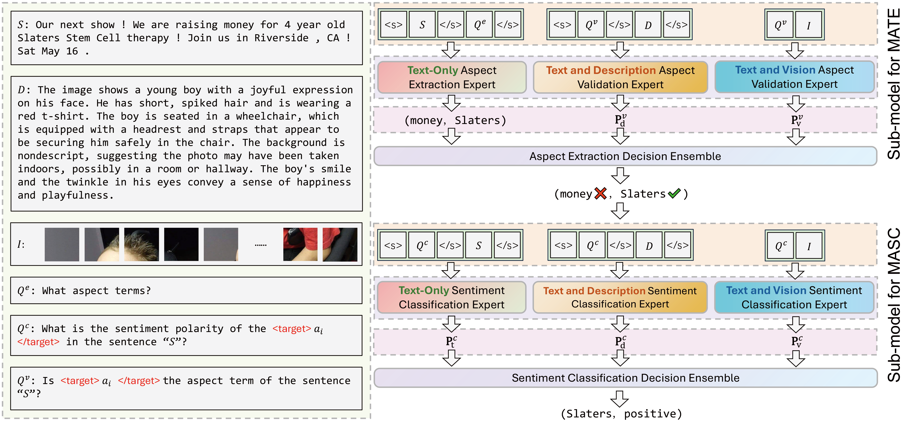

# DEQA: Descriptions Enhanced Question-Answering Framework for Multimodal Aspect-Based Sentiment Analysis
Multimodal aspect-based sentiment analysis (MABSA) integrates text and images to perform fine-grained sentiment analysis on specific aspects, enhancing the understanding of user opinions in various applications. Existing methods use modality alignment for information interaction and fusion between images and text, but an inherent gap between these two modalities necessitates a more direct bridging mechanism to effectively connect image understanding with text content. For this, we propose the Descriptions Enhanced Question-Answering Framework (DEQA), which generates descriptions of images using GPT-4, leveraging the multimodal large language model to provide more direct semantic context of images. In DEQA, to help the model better understand the task's purpose, we frame MABSA as a multi-turn question-answering problem to add semantic guidance and hints. We input text, image, and description into separate experts in various combinations, allowing each expert to focus on different features and thereby improving the comprehensive utilization of input information. By integrating these expert outputs within a multi-turn question-answering format, we employ a multi-expert ensemble decision-making approach to produce the final prediction results. Experimental results on two widely-used datasets demonstrate that our method achieves state-of-the-art performance. Furthermore, our framework substantially outperforms GPT-4o and other multimodal large language models, showcasing its superior effectiveness in multimodal sentiment analysis.



## Environment Setup
1. Create an Anaconda virtual environment named `DEQA`:
```bash
conda env create -f environment.yml
```
2. Activate the created environment:
```bash
conda activate DEQA
```

## Creat the Dataset
1. The datasets we use, Twitter2015 and Twitter2017, are from (Yu and Jiang 2019). You can download the datasets from [Twitter2015 and Twitter2017](https://github.com/jefferyYu/TomBERT?tab=readme-ov-file) (a GitHub page about Yu and Jiang (2019)'s TomBERT). As you can see, the downloaded datasets come as a compressed file (.zip). Extract this file to the current directory.
2. Change the dataset paths:
```bash
mv ./IJCAI2019_data/twitter2015 ./datasets/release/twitter2015/textual
mv ./IJCAI2019_data/twitter2015_images ./datasets/release/twitter2015/visual
mv ./IJCAI2019_data/twitter2017 ./datasets/release/twitter2017/textual
mv ./IJCAI2019_data/twitter2017_images ./datasets/release/twitter2017/visual
```
3. Descriptions of the images can be found at `.\datasets\release\twitter2015\description_roberta.jsonl` and `.\datasets\release\twitter2017\description_roberta.jsonl`

## Download Pre-trained Models
Download the pre-trained models from the Hugging Face website, and place them in the corresponding locations within the `.\pretrained_model\` folder according to their names.

## Train and Evaluate
```bash
./twitter2017.sh
./twitter2015.sh
```
You can find the results for the MATE task in `.\trained_model\Twitter2015MATEDecisionAddSentence_max_length_Fixed_padding_target_DeBERTaModel\result.json`. The results for the MASC task can be found in `.\trained_model\Twitter2015MASCDecisionModel\result.json`.

## References
Yu, J.; and Jiang, J. 2019. Adapting BERT for Target-Oriented Multimodal Sentiment Classification. In Proceedings of the Twenty-Eighth International Joint Conference on Artificial Intelligence, IJCAI-19, 5408–5414. International Joint Conferences on Artificial Intelligence Organization.